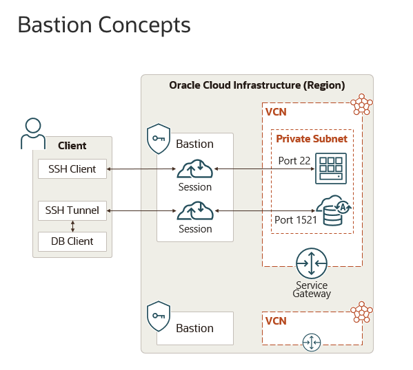

# oci-posh-utils

This is a PowerShell utility suite intended to help you automate access to resources in OCI (Oracle Cloud Infrastructure) 
that sits inside of a secure virtual network or VCN (Virtual Cloud Network) in OCI speak using the Bastion service.

It is assumed that the user is familiar with SSH.

```
                        +-----------------------------+
                        |        Public Internet      |
                        +-----------------------------+
                                      |
                                      | SSH / Managed Session
                                      v
                        +-----------------------------+
                        |       OCI Bastion Service   |
                        |  - No public IP needed      |
                        |  - Time-bound access        |
                        |  - SSH / RDP / Port Fwd     |
                        +-----------------------------+
                                      |
                                      | Private Access Tunnel
                                      v
       -------------------------------------------------------------------------------------
       |                    OCI Virtual Cloud Network (VCN)                                |
       |                                                                                   |
       |   Left: SSH/RDP to Private Compute            Right: Port Fwd to DB               |
       |                                                                                   |
       |   +-------------------+                         +-------------------+             |
       |   | Private Subnet    |                         | Private Subnet    |             |
       |   | (No Public IPs)   |                         | (No Public IPs)   |             |
       |   +-------------------+                         +-------------------+             |
       |            |                                            |                         |
       |            | SSH / RDP via Bastion                      | Port Forwarding Session |
       |            v                                            v                         |
       |   +-------------------+                         +----------------------------+    |
       |   | Compute Instance  |                         | Database System / DB Node  |    |
       |   | (Target Host)     |                         | (e.g., ATP, DB System)     |    | 
       |   +-------------------+                         +----------------------------+    |
       |                                                                                   |
       ------------------------------------------------------------------------------------|

Notes:
- Left side: Standard Bastion-managed SSH or RDP session to compute resources.
- Right side: Bastion port-forwarding session to database targets (e.g., Oracle DB System, Autonomous Database private endpoint).
- No public IPs required for either compute or database hosts.
- Sessions are ephemeral, policy-controlled, and logged.
```

## Use cases 

1. Set up (virtual) wiring to make hosts -- with private addresses no permanent path to the public -- inside a VCN accessible to 
ssh based configuration management tools such as Ansible and PyInfra.
2. Configure local ports to point to endpoints inside a VCN -- with private addresses no permanent path to the public -- to 
be used with database tools such as Liquibase and Flyway. 
3. Create an interactive session to a serviec endpoint inside of a VCN -- with private addresses no permanent path to the public -- to 
be used with tools like `ssh` and `mongosh`.

Item (3) above was how this project started. I was so impressed by the ability to launch `sqlcl` or `mysqlsh` inside of the OCI control
panel that I wanted to replicate it. `./Scripts/Invoke_Ssh_Session.ps1` and `./Scripts/Invoke_Mongosh_Session.ps1` can be used as
templates for creating your own scripts and for tips on how you can possibly automate access to database endpoints inside of OCI.   

## Notes 

### Requirements for regular setup

Clone the repo. 

The following software must be installed in your environment:
- [OCI PowerShell Modules](doc/powershell_modules.md) 
- OpenSSH binaries
- mongosh (for Invoke_Mongosh_Session.ps1)
- mysqlsh (new features coming soon)

Import the cmdlets like so: ` Import-Module ./oci-posh-utils.psd1`. 

### Create and run container

1. Clone repo
2. From top level in project directory execute the following. Substitute podman with your container tool:
`podman build --tag oci-posh-utils -f ./container/Containerfile `. 
3. Run interactively: `podman run -u 1654 -it -v ~/.oci:/home/app/.oci:ro oci-posh-utilst`.  

Explanations:  
- `-u 1654` ensures container starts with user `app` and not `root`. 
- `-v ~/.oci:/home/app/.oci:ro`ensureas that the user's oci config directory becomes visible for the `app`user inside the container. 

### Why PowerShell? 

PowerShell is an extremely powerful and forgiving environment for exploring an API. I especially appreciate the ability to inspect returned objects. This is the ultimate learning environment for me.


### Usage

Set:
- `$bastion_ocid = "x"`
- `$db_ocids= tofu output -json db_ocids | ConvertFrom-Json`: points to 3 db nodes inside names db-az1-1 .. 3.

```
$bastion_sessions_managed = $db_ocids | New-OpuManagedSshSessionFull -BastionId $bastion_ocid                             

$env:SSH_CONFIG_FILE=$bastion_sessions_managed | New-OpuSshConfigFileFromBastionManagedSession -HostBaseName db-az1- -TargetKeyFile $key_file

ssh -F $env:SSH_CONFIG_FILE db-az1-1
```


### Create your own setup/wraper scripts 

```powershell

<#
Set

$db_ocids
$bastion_ocid 
#>

$key_file = "/Users/espenbr/GitHub/oci-posh-utils/config/db.key"
$cfg_file = "/Users/espenbr/GitHub/oci-posh-utils/config/temp_ssh_config"

$bastion_sessions_managed = $db_ocids | OpuManagedSshSessionFull -BastionId $bastion_ocid

$temp_file = $bastion_sessions_managed | New-OpuSshConfigFileFromBastionManagedSession -IsProd $false -HostBaseName db-az1- -TargetKeyFile $key_file 

cat $temp_file > $cfg_file

ssh -F $cfgfile .. db-az-1 .. 3 
```


# Archive 

## Basic usage 

Let's jump straight into hwohow this may be used. 

Below I will:
- Grab OCID (identities) of a set of comote instances that sits in a privare network

Get ocids: 
```powershell
>$db_ocids= tofu output -json db_ocids | ConvertFrom-Json
>$db_ocids
ocid1.instance.oc1.eu-frankfurt-1.abcdefghijklmnopabcdefghijklmnopabcdefghijklmnopabcdefghijkx
ocid1.instance.oc1.eu-frankfurt-1.abcdefghijklmnopabcdefghijklmnopabcdefghijklmnopabcdefghijky
ocid1.instance.oc1.eu-frankfurt-1.abcdefghijklmnopabcdefghijklmnopabcdefghijklmnopabcdefghijkz
```

```powershell
>$bastion_ocid="ocid1.bastion.oc1.eu-frankfurt-1.abcdefghijklmnopabcdefghijklmnopabcdefghijklmnopabcdefghijka"
>$bastion_sessions_managed = $db_ocids | New-OpuManagedSshSessionFull -BastionId $bastion_ocid
Creating ephemeral key pair
Creating Manged SSH Session to 22 at target
Waiting for creation of bastion session to complete
Creating ephemeral key pair
Creating Manged SSH Session to 22 at target
Waiting for creation of bastion session to complete
Creating ephemeral key pair
Creating Manged SSH Session to 22 at target
Waiting for creation of bastion session to complete
```

What does this look like? (only first session/entry displayed) 
```
BastionSession : Oci.BastionService.Models.Session
SShCmd         : ssh -i  -o ProxyCommand="ssh -i 
                 /var/folders/9w/tt305cd54dz5ktqzh82t4tvw0000gp/T//bastionkey-2025_11_28_16_03_04-9030 -W %h:%p -p 22 ocid1.bastio
                 nsession.oc1.eu-frankfurt-1.amaaaaaa3gkdkiaamwrr6xelctxaraqyaxbl7l3mhi2b4d3j46r6473egsaq@host.bastion.eu-frankfur
                 t-1.oci.oraclecloud.com" -p 22 opc@10.0.1.163
KeyFile        : /var/folders/9w/tt305cd54dz5ktqzh82t4tvw0000gp/T//bastionkey-2025_11_28_16_03_04-9030
JumpUser       : ocid1.bastionsession.oc1.eu-frankfurt-1.amaaaaaa3gkdkiaamwrr6xelctxaraqyaxbl7l3mhi2b4d3j46r6473egsaq
JumpHost       : host.bastion.eu-frankfurt-1.oci.oraclecloud.com
TargetUser     : opc
TargetHost     : 10.0.1.163
TargetPort     : 22
SessionExpires : 28/11/2025 19:04:43

...

...
```

Lets create a ssh config file that uses this information so that uou can log in like so `ssh myhost`: 
```powershell
# Key file at targets
>$key_file = "/Users/espenbr/Documents/GitHub/oci-posh-utils/config/db.key"

## the hosts are called db-az-1..3 inside, so use "db-az1-" as -HostBaseName
>$bastion_sessions_managed |New-OpuSshConfigFileFromBastionManagedSession -HostBaseName db-az- -TargetKeyFile $key_file
/var/folders/9w/tt305cd54dz5ktqzh82t4tvw0000gp/T/tmpyVECM1.tmp

## only first entry shown in full 
>cat /var/folders/9w/tt305cd54dz5ktqzh82t4tvw0000gp/T/tmpyVECM1.tmp | head -13
#
# db-az- number 1 - target 10.0.1.163
Host db-az-1
  Hostname 10.0.1.163
  User opc
  Port 22
  IdentityFile /Users/espenbr/Documents/GitHub/oci-posh-utils/config/db.key
  ServerAliveInterval 30
  ServerAliveCountMax 4
  StrictHostKeyChecking no
  UserKnownHostsFile=/dev/null
  ProxyCommand ssh -i /var/folders/9w/tt305cd54dz5ktqzh82t4tvw0000gp/T//bastionkey-2025_11_28_16_03_04-9030 -W %h:%p -p 22 ocid1.bastionsession.oc1.eu-frankfurt-1.amaaaaaa3gkdkiaamwrr6xelctxaraqyaxbl7l3mhi2b4d3j46r6473egsaq@host.bastion.eu-frankfurt-1.oci.oraclecloud.com

## Now, let's connect 
>ssh -F /var/folders/9w/tt305cd54dz5ktqzh82t4tvw0000gp/T/tmpyVECM1.tmp db-az-1
Warning: Permanently added '10.0.1.163' (ED25519) to the list of known hosts.
Activate the web console with: systemctl enable --now cockpit.socket

Last login: Tue Nov 25 16:58:31 2025 from 10.0.0.10
```

## Cmdlets to manage Bastion sessions

The OCI Bastion service provides three types of sessions, two of which are supported by this module:
- Port forwarding sessions
- Managed SSH sessions

These are described in the doc [here](https://docs.oracle.com/en-us/iaas/Content/Bastion/Concepts/bastionoverview.htm). 
I have borrowed the illustation below from the doc. 



Thw two key cmdlets that allows you to create sessions are: 

### New-OpuPortForwardingSessionFull

```
.SYNOPSIS
Create a port forwarding sesssion with OCI Bastion service.
Generate SSH key pair to be used for session.
Create the actual port forwarding SSH process.

Return an object to the caller:
```

```Powershell
$bastionSessionDescription = [PSCustomObject]@{
    PSTypeName = 'OpuPortBastionSession.Object'
    BastionSession = $bastionSession
    SShProcess = $sshProcess
    LocalPort = $useThisPort
    TargetHost = $TargetHost
    TargetPort = $TargetPort
    SessionExpires = <SessionExpireTimeInLocalTime>
}
```

### New-OpuManagedSshSessionFull

```
.SYNOPSIS
Create a mamnaged SSH sesssion with OCI Bastion service.

Return an object to the caller:

The SshCmd attribute contains a formated SSH command string that can be used directly on the command line.
The KeyFile, JumpUser/JumpHost & TargetUser/TargetHost/TargetPort are intended for use with automation tools 
such as Ansible and PyInfra.   
```

```Powershell
$bastionSessionDescription = [PSCustomObject]@{
    PSTypeName     = 'OpuManagedBastionSession.Object'
    BastionSession = $bastionSession
    SShCmd         = <fully formated ssh command>
    KeyFile        = <key file generated for the session>
    JumpUser       = <jump user for the session>
    JumpHost       = <jump host for the session>
    TargetUser     = <target user for the session>
    TargetHost     = <target host for the session>
    TargetPort     = <target port for the session<
    SessionExpires = <SessionExpireTimeInLocalTime>
}
```

## Utility scripts

TODO: Need to improve doc so that can be copied into this part. 

### Invoke_Ssh_Session.ps1

```
.SYNOPSIS
Invoke  an SSH  sesssion with a target host accessible through the OCI Bastion service using a secret from the OCI vault.

.DESCRIPTION
Using the Bastion service and tunneling a SSH session will be invoked on the target host using a secret from the OCI vault as the SSH key. 

The session management wrt the Bastion is handled by cmdlet New-OpuPortForwrdingSessionFull. 
This allows you to "connect" through the Bastion service via a local port and to your destination: $TargetHost:$TargetPort   

A path from the Bastion to the target is required.
The Bastion session inherits TTL from the Bastion (instance). 
```

### Invoke_Mongosh_Session.ps1

```
.SYNOPSIS
Invoke  an mongosh sesssion with a target host accessible through the OCI Bastion service using a DatabaseToolsConnection.

.DESCRIPTION
Using the Bastion service and tunneling, a mongosh session will be invoked on the target DB system identified by -ConnectionId.
The referenced DatabaseTools object contains all the information needed to establish a connection: 
- username
- portt
- ip address
- connection string

The port forwarding session is created by the New-OpuPortForwardingSessionFull cmdlet. 
This allows you to "connect" through the Bastion service via a local port and to your destination: $TargetHost:$TargetPort   

A path from the Bastion to the target is required.
The Bastion session inherits TTL from the Bastion (instance). 
```


## Requirements 

### OCI

### Auth 

### Etc


>>>>>>>>>>>>>>>>>


## Various 

OCI powershell utils

Code structure inspired by 
https://www.psplaybook.com/2025/02/06/powershell-modules-best-practices/

The initial inspiration for this set of utils was the Detabase Development Tools of OCI. 
In one operation the "engine" performs teh following actions: 
- Pull connection information from vault (ip, user, pass)
- Create a bastion session
- Create a port forwarding session through the  

```shell
tofu output -json db_ocids | ConvertFrom-Json
>>
ocid1.instance.oc1.eu-frankfurt-1.longcrypticuuidstyletexthereandlongcrypticuuidstyletextherex
ocid1.instance.oc1.eu-frankfurt-1.longcrypticuuidstyletexthereandlongcrypticuuidstyletextherey
ocid1.instance.oc1.eu-frankfurt-1.longcrypticuuidstyletexthereandlongcrypticuuidstyletextherez
```

```shell
tofu output -json db_ips | ConvertFrom-Json
>>
10.0.1.77
10.0.1.80
10.0.1.210
```

Import the psd1 to get 
```shell
Import-Module ./oci-posh-utils.psd1 
```

## User guide sample 

### Super short

1. Assign local variables for secrets and bastion. Download SSH key from vault. 
2. Get IP addresses from terraform into local list.
3. Create SSH forwarding sessions for each target, starting at 9003.
4. Execute configuration command against all targets.

```powershell
## 1.
$bastion_ocid='xyz...'
$sshkey_ocid='xyz...'
$file_name=Get-OpuSecret -SecretId $sshkey_ocid -AsFile $true -AsPlainText $true

## 2.
$ip_address_list = terraform output -json ip_addresses | ConvertFrom-Json

## 3.  
$bastion_session_list = $ip_address_list | New-OpuPortForwardingSessionFull -BastionId $bastion_ocid -LocalPort 9003

## 4.  
foreach ($target in $bastion_session_list) {
    $localPort =$target.LocalPort 
    fab --hosts opc@127.0.0.1:${localPort} -i $file_name -- 'hostname'
}
db1
db2
db3
```

Configure firewalls for MySQL
```powershell
foreach ($target in $bastion_session_list) {
    $localPort =$target.LocalPort 
    fab --hosts opc@127.0.0.1:${localPort} -i $file_name configureFirewalld
}
```


Install and configure MySQL
```powershell
$mysql_password = Get-OpuSecret -SecretId $mysql_secret_ocid -AsPlainText $true -AsFile $false

foreach ($target in $bastion_session_list) {
    $localPort =$target.LocalPort 
    fab --hosts opc@127.0.0.1:${localPort} -i $file_name runMysqlInstaller --newpassword=${mysql_password}
}
```

or just one, I know it is on 9003, but address into list.
```powershell
$localPort =$bastion_session_list[0].LocalPort 
fab --hosts opc@127.0.0.1:${localPort} -i $file_name runMysqlInstaller --newpassword=${mysql_password}
```

Then finally, apply config changes
```powershell
$localPort =$bastion_session_list[0].LocalPort 
fab --hosts opc@127.0.0.1:${localPort} -i $file_name configureMysqlSettings --password=${mysql_password}
```


## Remember

```powershell
❯ Get-Command -Module oci-posh-utils

CommandType     Name                                               Version    Source
-----------     ----                                               -------    ------
Function        Get-OpuSecret                                      0.8        oci-posh-utils
Function        New-OpuManagedSshSessionFull                       0.8        oci-posh-utils
Function        New-OpuPortForwardingSessionFull                   0.8        oci-posh-utils
Function        New-OpuSshConfigFileFromBastionManagedSession      0.8        oci-posh-utils
Function        New-OpuSshKeyFromKeygen                            0.8        oci-posh-utils
Function        New-OpuSshKeyFromSecret                            0.8        oci-posh-utils
Function        Remove-OpuManagedSshsessionFull                    0.8        oci-posh-utils
Function        Remove-OpuPortForwardingSessionFull                0.8        oci-posh-utils
Function        Test-OpuIpAddr                                     0.8        oci-posh-utils
Function        Test-OpuMysqlshAvailable                           0.8        oci-posh-utils
Function        Test-OpuOcidString                                 0.8        oci-posh-utils
Function        Test-OpuPortForwardingSessionFull                  0.8        oci-posh-utils
Function        Test-OpuSshAvailable                               0.8        oci-posh-utils
```

## Tidbits 

Q: Why ips and not (dns)names? 
A: The Bastion servicse only allows for ip addresses.

